<div align="center">


# PKMessenger

**Dein Discord-Server – als schlanker Messenger auf dem Windows-Desktop.**
Lesen, schreiben, erwähnen, suchen und in Sprachkanälen sprechen, ohne den Discord-Client zu öffnen. Alles läuft über deinen **eigenen Bot**.

[](https://github.com/Morni-Team/pkmessenger/releases/latest)
[](#-installation)
[](LICENSE)
[](#)

[**⬇️ Herunterladen**](https://github.com/Morni-Team/pkmessenger/releases/latest) · [Funktionen](#-funktionen) · [Einrichtung](#-bot-einrichten-einmalig-ca-10-minuten) · [Anrufe](#-sprachkanäle-anrufe) · [FAQ](#-häufige-fragen)

<br>

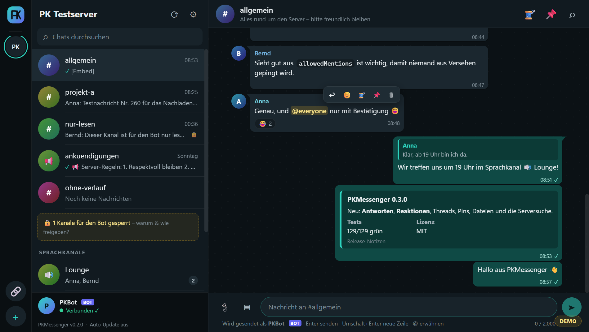

<sub>Bildschirmfoto aus dem Demo-Modus mit Beispieldaten (oben rechts „DEMO“).</sub>

</div>

---

## 💡 Was ist PKMessenger?

PKMessenger sieht aus wie ein moderner Messenger: links deine Chats mit Vorschau und Uhrzeit, rechts die Unterhaltung in Sprechblasen. Im Hintergrund steckt aber **kein** persönlicher Discord-Account, sondern ein **Bot, den du selbst anlegst** und auf deinen Server einlädst. So bleibt alles im Rahmen der offiziellen Discord-Regeln.

> **Wichtig, damit keine falschen Erwartungen entstehen:** Nachrichten und Sprache laufen immer als dein Bot, mit sichtbarem **BOT**-Abzeichen. PKMessenger ist kein offizielles Discord-Produkt und ersetzt nicht deinen persönlichen Account.

---

## ✨ Funktionen

| | |
|---|---|
| 💬 **Messenger-Ansicht** | Chat-Liste sortiert nach letzter Aktivität, Vorschau der letzten Nachricht, Ungelesen-Zähler, Sprechblasen mit Häkchen ✓ |
| ⚡ **Live** | Neue Nachrichten und „Anna schreibt …“ erscheinen sofort, deine Nachricht steht ohne Wartezeit im Chat |
| 📜 **Ganzer Verlauf** | Beim Hochscrollen werden ältere Nachrichten automatisch nachgeladen. Auch Tausende Nachrichten bleiben flüssig |
| @ **Erwähnungen** | `@` tippen → Personen und Rollen vorschlagen lassen. `#` → Kanäle. Gepingt wird nur, wen du wirklich auswählst |
| 🛡️ **Schutz vor Massen-Ping** | `@everyone` und `@here` gehen nur nach einer Rückfrage raus |
| 🔊 **Sprachkanäle** | Beitreten, über den Bot sprechen, die anderen hören, Mikro und Ton schalten, auflegen |
| ↩️ **Antworten** | Auf Nachrichten antworten, mit Zitat; der Verfasser wird nur gepingt, wenn du es willst |
| 😊 **Reaktionen** | Mit Emojis reagieren (auch eigene Server-Emojis), live aktualisiert |
| ✏️ **Bearbeiten & Löschen** | Eigene Nachrichten nachträglich ändern oder löschen (mit Rückfrage) |
| 📎 **Dateien & Bilder** | Per 📎, Strg+V oder Ziehen – bis 25 MiB pro Nachricht |
| ▤ **Embeds** | Hübsche Info-Karten mit Titel, Text, Farbe und Live-Vorschau |
| 🧵 **Threads & Foren** | Threads starten und lesen, Forum-Beiträge ansehen und erstellen |
| 📌 **Pins** | Wichtige Nachrichten anheften, Liste aller angehefteten Nachrichten |
| 🔍 **Schnell finden** | <kbd>Strg</kbd>+<kbd>K</kbd> springt zu jedem Chat, <kbd>Strg</kbd>+<kbd>F</kbd> sucht im Chat **oder im ganzen Server** |
| 🔗 **Server beitreten** | Einladungslink einfügen → Vorschau → selbst in Discord beitreten → Bot mit einem Klick nachholen |
| ⌨️ **Slash-Befehle** | <code>/ping</code> und <code>/pkmessenger</code> funktionieren auf deinen Servern |
| 🔄 **Auto-Update** | Neue Versionen kommen automatisch, ohne Neuinstallation |
| 🇩🇪 **Komplett auf Deutsch** | Oberfläche, Datumsangaben und verständliche Fehlermeldungen mit „Was kann ich tun?“ |
| 🔒 **Privat & sicher** | Keine Cloud, keine Werbung, keine Telemetrie. Dein Bot-Token wird **verschlüsselt** (Windows-Datenschutz) nur auf deinem PC gespeichert |

<table>
  <tr>
    <td width="50%">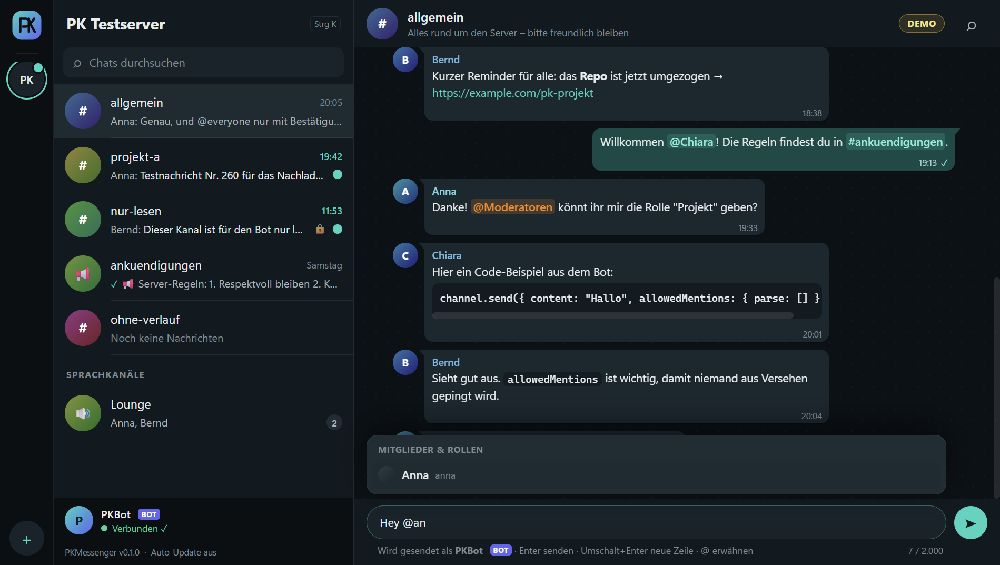<br><sub><b>Erwähnen:</b> <code>@an</code> tippen, Anna auswählen, fertig.</sub></td>
    <td width="50%">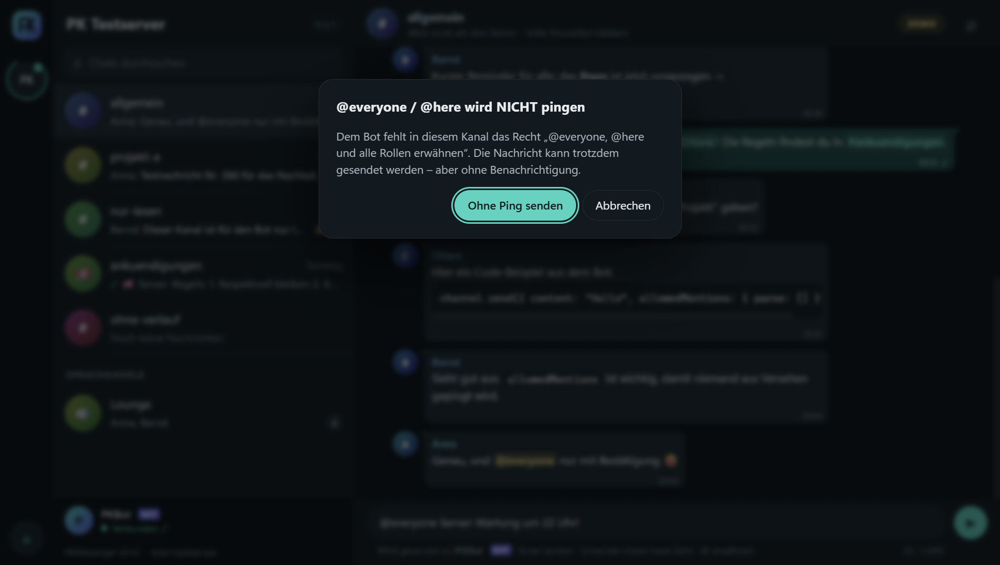<br><sub><b>Kein versehentlicher Massen-Ping:</b> <code>@everyone</code> nur mit Bestätigung.</sub></td>
  </tr>
  <tr>
    <td>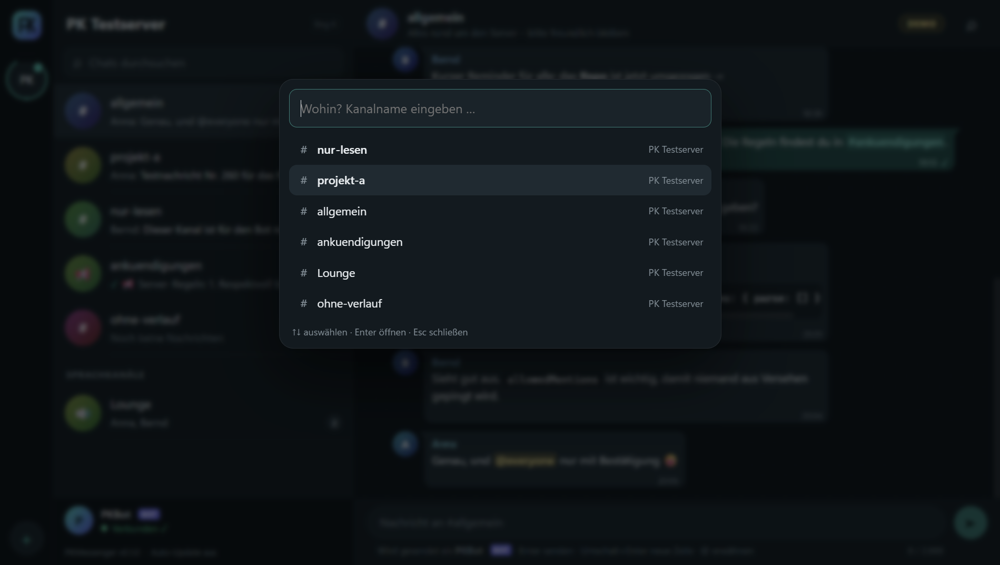<br><sub><b>Strg+K:</b> Zu jedem Chat springen.</sub></td>
    <td>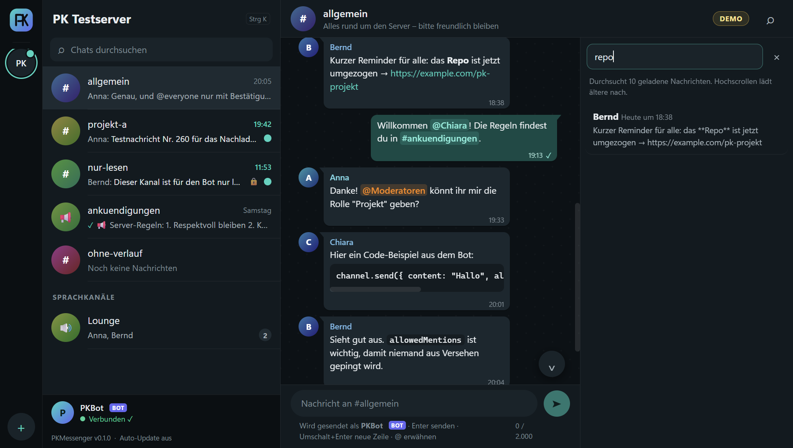<br><sub><b>Strg+F:</b> Im Verlauf suchen, Treffer anklicken, hinspringen.</sub></td>
  </tr>
</table>

---

## 💬 Alles, was ein Messenger braucht

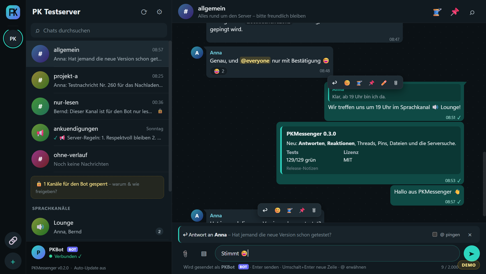

<table>
  <tr>
    <td width="50%">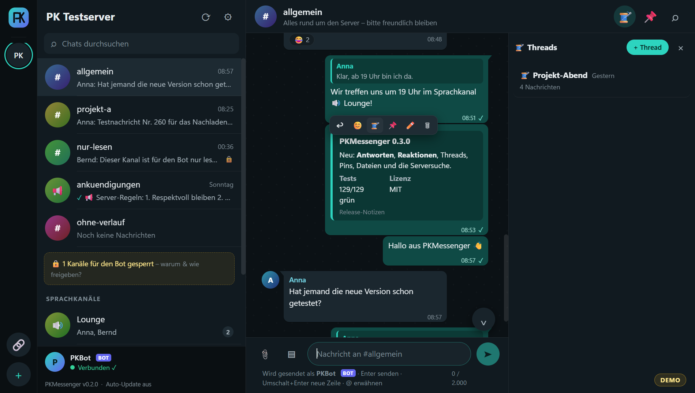<br><sub><b>Threads:</b> starten, lesen, antworten.</sub></td>
    <td width="50%">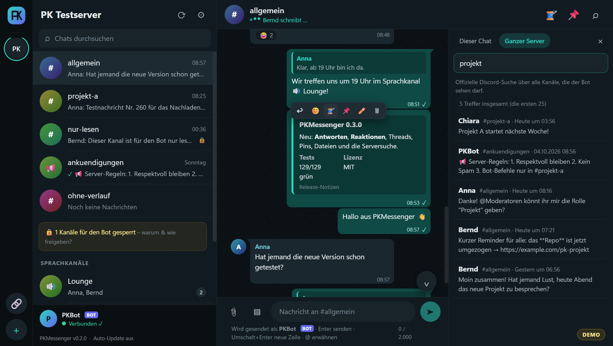<br><sub><b>Suche im ganzen Server</b> (offizielle Discord-Suche).</sub></td>
  </tr>
  <tr>
    <td>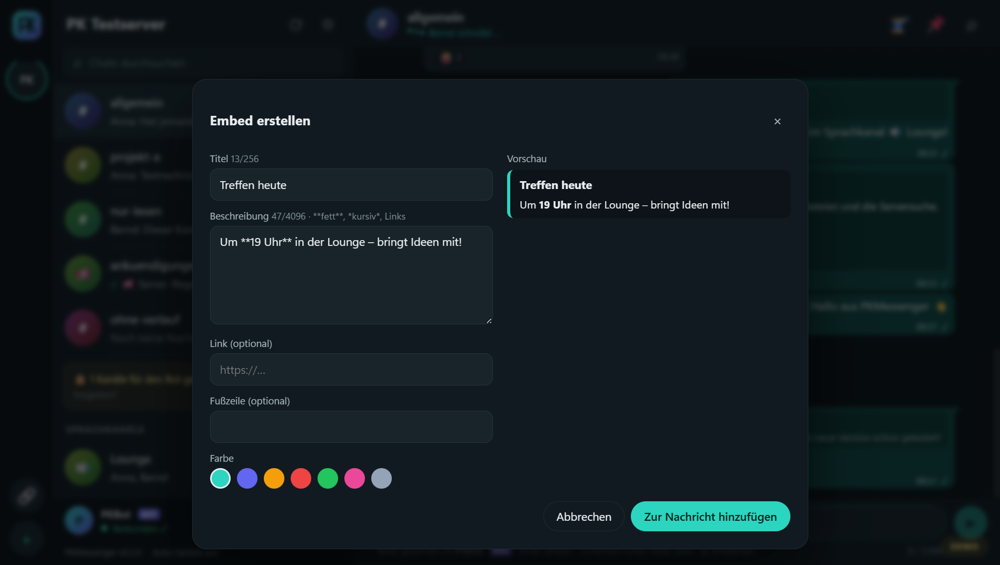<br><sub><b>Embed-Baukasten</b> mit Live-Vorschau.</sub></td>
    <td>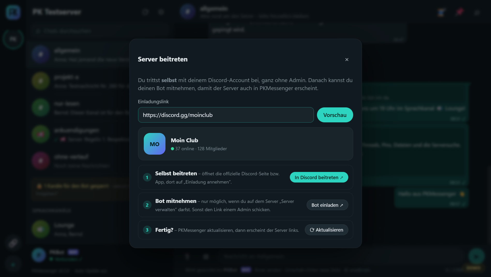<br><sub><b>Server beitreten:</b> selbst in Discord beitreten, Bot nachholen.</sub></td>
  </tr>
  <tr>
    <td>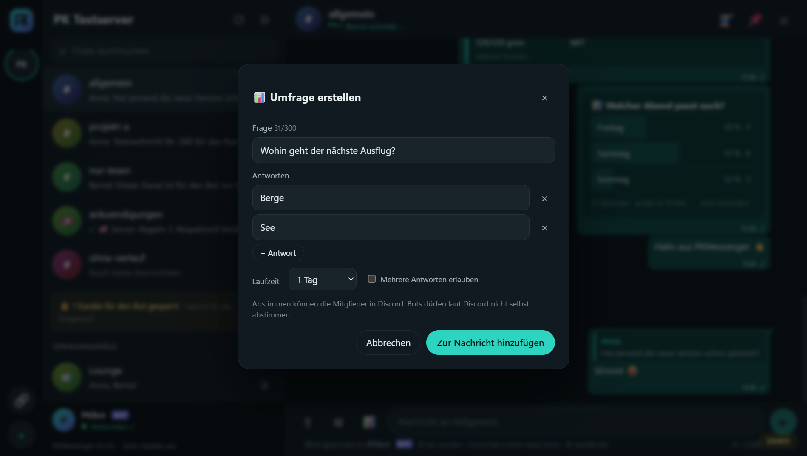<br><sub><b>Umfragen:</b> erstellen, Ergebnisse live, vorzeitig beenden.</sub></td>
    <td>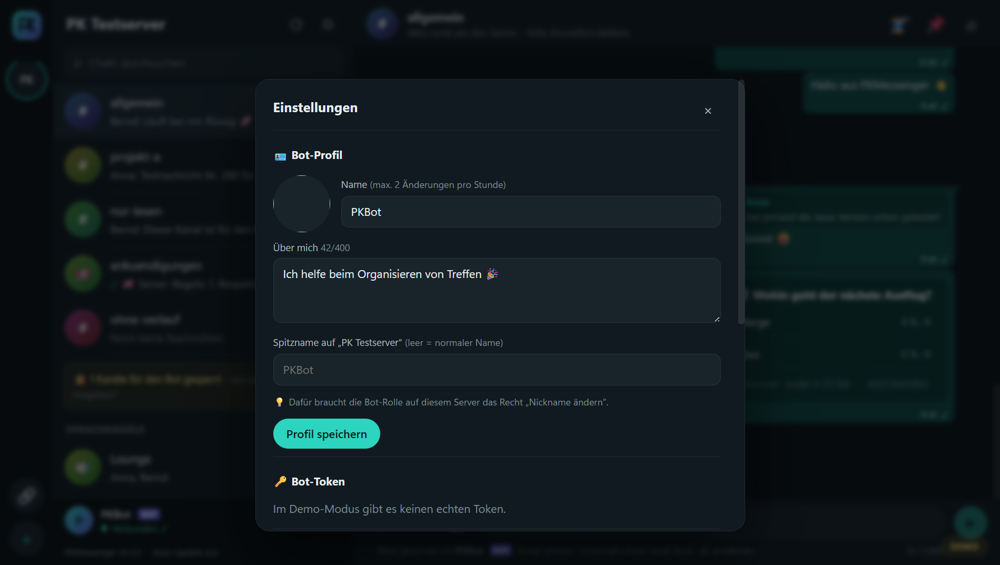<br><sub><b>Bot-Profil:</b> Name, Bild, „Über mich“, Spitzname je Server.</sub></td>
  </tr>
  <tr>
    <td>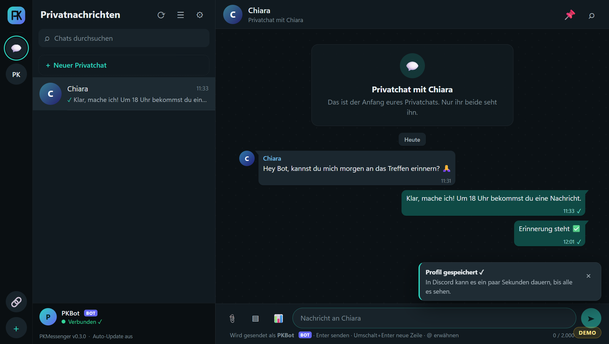<br><sub><b>Privatnachrichten:</b> privat mit einzelnen Leuten schreiben (als Bot).</sub></td>
    <td>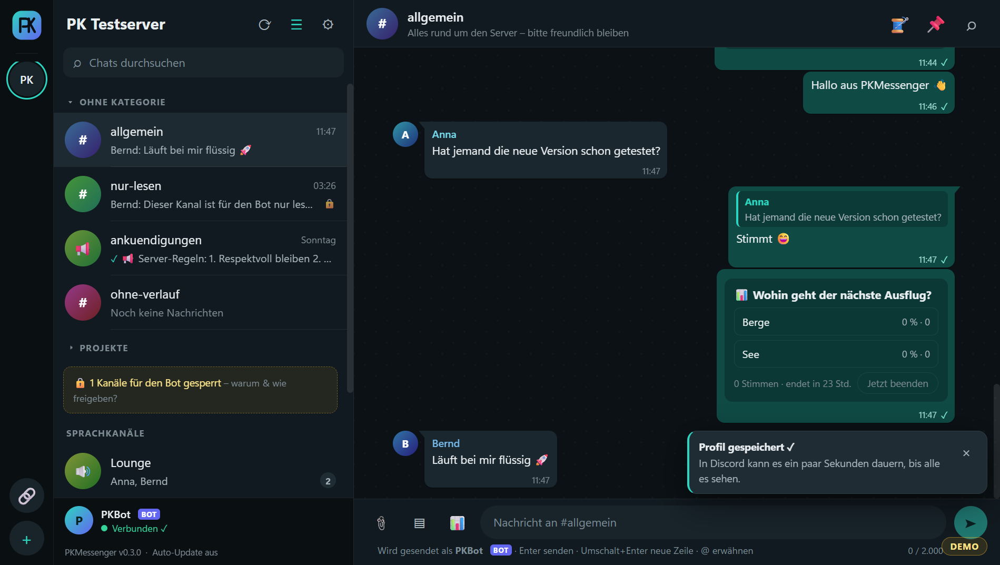<br><sub><b>Kategorien einklappen</b> und Bildschirmschutz.</sub></td>
  </tr>
  <tr>
    <td>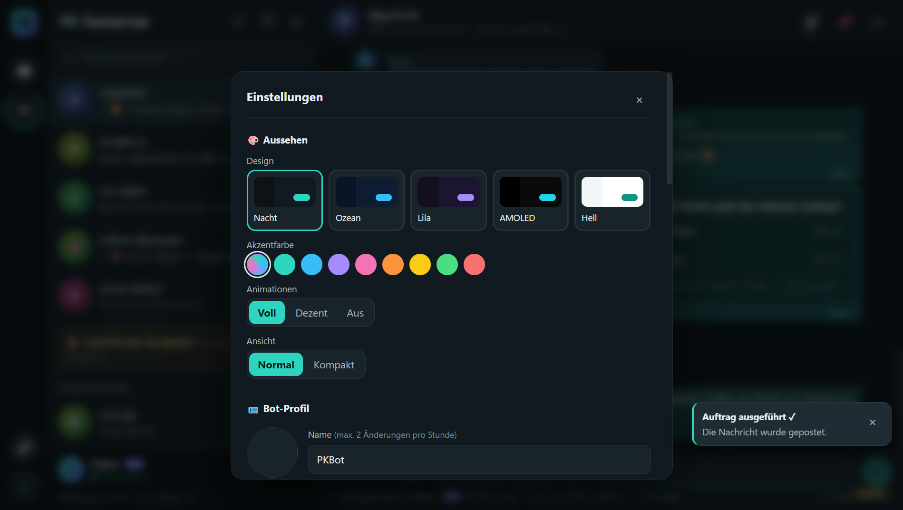<br><sub><b>🎨 Aussehen:</b> 5 Designs, eigene Akzentfarbe, Animationen, kompakte Ansicht.</sub></td>
    <td>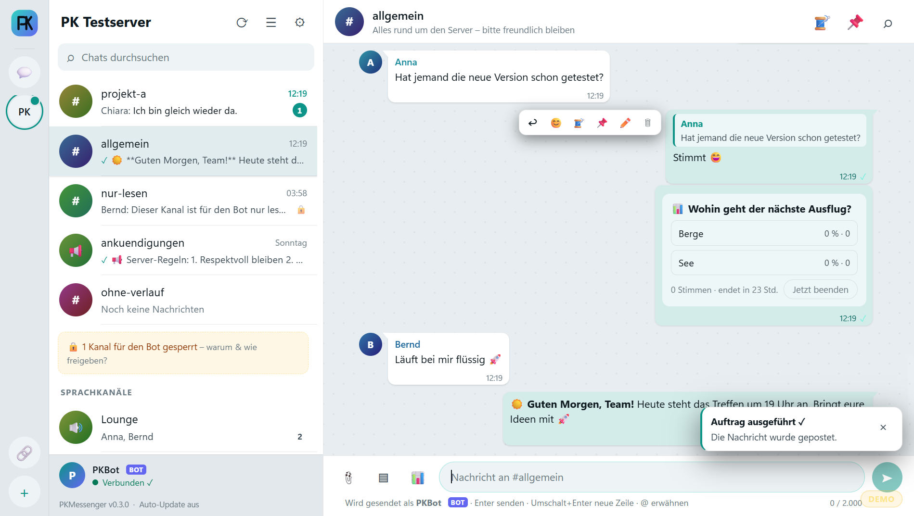<br><sub><b>Helles Design</b> – umschaltbar in den Einstellungen.</sub></td>
  </tr>
  <tr>
    <td colspan="2">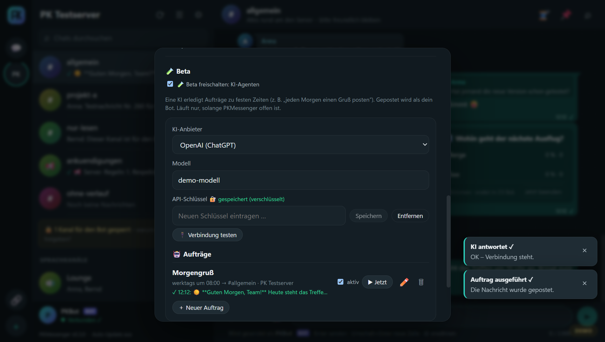<br><sub><b>🧪 KI-Agenten (Beta):</b> Aufträge wie „jeden Werktag um 8 Uhr einen Morgengruß posten“ – mit OpenAI, Claude, Gemini, OpenRouter, Ollama u. v. m. Dein Schlüssel bleibt verschlüsselt auf deinem PC.</sub></td>
  </tr>
</table>

---

## 🔊 Sprachkanäle (Anrufe)

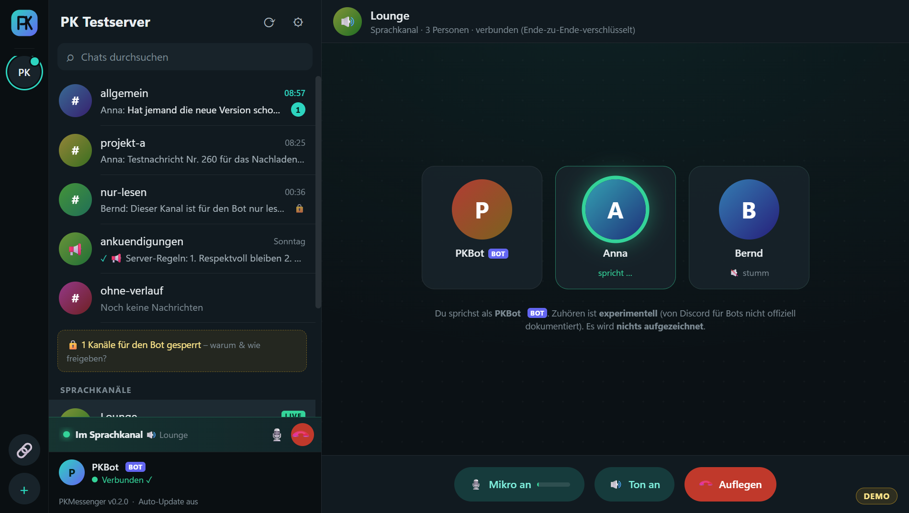

- **Beitreten** mit einem Klick. Danach zeigt eine Anrufleiste unten links, dass du verbunden bist, auch wenn du nebenbei chattest.
- **Mikro an/aus:** Die anderen hören dich als **„DeinBot [BOT]“**. Das Mikrofon wird beim Ausschalten komplett freigegeben.
- **Ton an/aus:** Die anderen hören. Wer gerade spricht, leuchtet grün.
- **Ende-zu-Ende-verschlüsselt** über das DAVE-Protokoll, das Discord seit März 2026 vorschreibt.
- **Es wird nichts aufgezeichnet.** Ton wird nur live durchgereicht.

> ⚠️ **Gut zu wissen:** Discord dokumentiert das *Zuhören* für Bots nicht offiziell, deshalb ist es in PKMessenger als „experimentell“ markiert. **Nicht möglich** sind mit Bots grundsätzlich: einzelne Personen direkt anrufen, Video und Bildschirm teilen.

---

## 📦 Installation

1. Lade die neueste **`PKMessenger-Setup.exe`** herunter: **[→ Releases](https://github.com/Morni-Team/pkmessenger/releases/latest)**
2. Doppelklick, und PKMessenger installiert sich und startet. Eine Verknüpfung landet auf dem Desktop und im Startmenü.
3. Beim ersten Start führt dich die App durch die Einrichtung (siehe unten).

> Windows SmartScreen meldet sich eventuell mit „Unbekannter Herausgeber“, weil die App (noch) nicht kostenpflichtig signiert ist. Klicke dann auf **„Weitere Informationen“ → „Trotzdem ausführen“**.

**Updates kommen automatisch.** Die App prüft beim Start und alle 6 Stunden, ob es eine neue Version gibt, lädt sie im Hintergrund und fragt dann: *„Update bereit – Jetzt neu starten?“*

---

## 🤖 Bot einrichten (einmalig, ca. 10 Minuten)

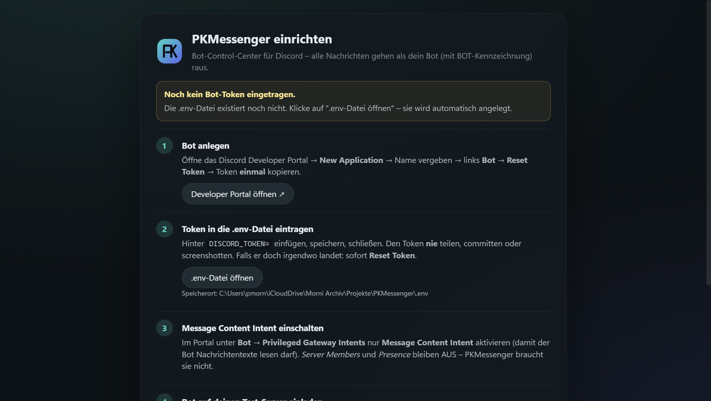

Die App zeigt dir diese Schritte auch selbst an:

1. **Bot anlegen:** Öffne das [Discord Developer Portal](https://discord.com/developers/applications) → **New Application** → Namen vergeben → links **Bot** → **Reset Token** → Token **einmal** kopieren.
2. **Token eintragen:** In PKMessenger den Token ins Feld einfügen und **„Speichern & verbinden“** klicken. Er wird sofort **verschlüsselt** gespeichert (an dein Windows-Konto gebunden) und nie wieder angezeigt. Ändern kannst du ihn später unter ⚙ Einstellungen.
   > 🔐 Den Token **nie** weitergeben, posten oder abfotografieren. Er ist das Passwort deines Bots. Falls er doch irgendwo landet: im Portal sofort **Reset Token**.
3. **Message Content Intent einschalten:** Im Portal unter **Bot → Privileged Gateway Intents** nur **Message Content Intent** aktivieren. *Server Members* und *Presence* bleiben aus, die braucht PKMessenger nicht.
4. **Bot einladen:** Die App zeigt dir den fertigen **Einladungslink** an. Er enthält genau die nötigen Rechte: Kanäle ansehen, Nachrichten senden, Verlauf lesen, Reaktionen, Dateien, Links einbetten, Verbinden, Sprechen.
5. **Verbinden** klicken. Fertig, unten links steht **„Verbunden ✓“**.

> Solange PKMessenger nicht läuft, zeigt Discord deinen Bot als **offline** an. Das ist normal. Der Bot sieht außerdem nur Kanäle, die seine Rolle sehen darf.

---

## ⌨️ Tastenkürzel

| Kürzel | Aktion |
|---|---|
| <kbd>Enter</kbd> | Nachricht senden |
| <kbd>Umschalt</kbd>+<kbd>Enter</kbd> | Neue Zeile |
| <kbd>@</kbd> / <kbd>#</kbd> | Person/Rolle bzw. Kanal erwähnen |
| <kbd>Strg</kbd>+<kbd>K</kbd> | Zu einem Chat springen |
| <kbd>Strg</kbd>+<kbd>F</kbd> | Im Verlauf suchen |
| <kbd>Alt</kbd>+<kbd>↑</kbd>/<kbd>↓</kbd> | Vorheriger / nächster Chat |
| <kbd>Esc</kbd> | Dialog oder Vorschläge schließen |

---

## 🔒 Datenschutz & Fairness

- **Nur offizielle Discord-Bot-API.** Keine Self-Bots, keine User-Tokens, keine Client-Mods. Das würde gegen die Discord-Regeln verstoßen und deinen Account gefährden.
- **Jede Nachricht ist als Bot gekennzeichnet.** Niemand wird getäuscht.
- **Datensparsam:** Gespeichert werden nur, welchen Chat du zuletzt offen hattest und bis wohin du gelesen hast. Der Token liegt ausschließlich in deiner lokalen `.env`-Datei.
- **Keine Cloud, keine Analyse, keine Telemetrie.** Für Updates fragt die App nur nach der neuesten Version, dabei werden App-Version und Plattform übertragen, keine persönlichen Daten.
- **Sprachkanäle:** nichts wird aufgezeichnet.

---

## ❓ Häufige Fragen

<details>
<summary><b>Kann ich über meinen persönlichen Discord-Account schreiben?</b></summary>

Nein. Discord bietet dafür keine erlaubte Schnittstelle, das wäre ein sogenannter Self-Bot und kann zur Sperrung deines Accounts führen. PKMessenger nutzt deshalb immer einen eigenen Bot.
</details>

<details>
<summary><b>Kann ich Leute anrufen wie bei WhatsApp?</b></summary>

Bots können nur **Sprachkanälen auf Servern** beitreten. Einzelne Personen direkt anrufen geht mit Bots nicht, Video und Bildschirm teilen ebenfalls nicht.
</details>

<details>
<summary><b>Warum sehe ich manche Kanäle nicht?</b></summary>

Der Bot sieht nur Kanäle, die seine Rolle sehen darf. Gib der Bot-Rolle in den Kanaleinstellungen „Kanal ansehen“ (und zum Schreiben „Nachrichten senden“).
</details>

<details>
<summary><b>Muss mein PC laufen?</b></summary>

Ja. Der Bot ist online, solange PKMessenger läuft. Ist die App geschlossen, ist der Bot offline.
</details>

<details>
<summary><b>Kostet das etwas?</b></summary>

Nein. PKMessenger ist kostenlos und quelloffen (MIT-Lizenz). Auch Discord-Bots sind kostenlos.
</details>

<details>
<summary><b>Die App sagt „Discord hat den Token abgelehnt“.</b></summary>

Der Token ist falsch oder wurde zurückgesetzt. Im Developer Portal unter **Bot → Reset Token** einen neuen erzeugen und in die `.env` eintragen.
</details>

---

## 🛠️ Für Entwickler

```powershell
git clone https://github.com/Morni-Team/pkmessenger.git
cd pkmessenger
npm install
npm run demo     # Oberfläche mit Beispieldaten ansehen – ohne Token
npm start        # echte App
```

| Befehl | Zweck |
|---|---|
| `npm start` | App starten |
| `npm run demo` | Demo ohne Discord (Beispieldaten, „DEMO“-Badge) |
| `npm test` | Alle Tests (Node-Testrunner) |
| `npm run make` | Windows-Installer + ZIP bauen |
| `npm run publish` | Neue Version als GitHub-Release veröffentlichen (`GITHUB_TOKEN` nötig) |
| Version in `package.json` erhöhen + nach `main` | **Vollautomatisch:** GitHub Actions erkennt die neue Version, setzt den Tag, testet, baut den Installer und veröffentlicht das Release mit Notizen (`.github/workflows/release.yml`) |
| `npm run update` | Quellcode auf den neuesten Stand holen (git pull + Build) |

**Technik:** Electron 44 · discord.js 14 · @discordjs/voice (DAVE) · React 19 · react-window · esbuild · Electron Forge.
Sprache läuft ohne FFmpeg und ohne native Opus-Module: Kodiert wird mit WebCodecs direkt im eingebauten Chromium.

**Sicherheit:** Der Token bleibt im Hauptprozess, die Oberfläche läuft in einer Sandbox mit strenger Content-Security-Policy, und jede Anfrage zwischen Oberfläche und Hauptprozess wird geprüft.

Mehr Details: [AGENTS.md](AGENTS.md) (Architektur, Entscheidungen, Teststand) · [error.md](error.md) (Fehlerprotokoll)

---

## 🗺️ Geplant

- [x] Auf Nachrichten antworten (mit Zitat-Vorschau)
- [x] Reaktionen mit Emoji-Auswahl
- [x] Eigene Nachrichten bearbeiten und löschen
- [x] Dateien und Bilder senden (bis 25 MiB)
- [x] Embeds anzeigen und erstellen
- [x] Threads und Forum-Beiträge
- [x] Angeheftete Nachrichten
- [x] Serverweite Suche
- [x] Slash-Befehle (<code>/ping</code>, <code>/pkmessenger</code>)
- [x] Sprachkanäle, Server beitreten, verschlüsselter Token, Einstellungen
- [x] Umfragen (erstellen, Ergebnisse live, beenden)
- [x] Bot-Profil bearbeiten (Name, Bild, Beschreibung, Spitzname je Server)
- [x] Chatliste nach Kategorien, einklappbar (☰ oben in der Liste)
- [x] Bildschirmschutz: Screenshots und Aufnahmen anderer Programme verbieten (Einstellungen → Datenschutz)
- [x] Privatnachrichten mit dem Bot (💬 in der Leiste links)
- [x] 🧪 Beta: KI-Agenten – eine KI postet zu festen Zeiten (beliebiger Anbieter, eigener API-Schlüssel)
- [x] 🔔 Benachrichtigungstöne: 4 eingebaute Klänge oder eigene WAV-Datei, getrennt für anderen Chat, offenen Chat, Erwähnung, Privatchat, KI-Antwort und Verbindungsfehler; Lautstärke, Testton, Drosselung, auch bei minimiertem Fenster
- [x] 🧪 Beta: KI antwortet, wenn der Bot erwähnt wird (Kanäle, Personen, Persönlichkeit einstellbar)
- [x] 🎨 Aussehen: 5 Designs (Nacht, Ozean, Lila, AMOLED, Hell), Akzentfarbe, Animationen (voll/dezent/aus), kompakte Ansicht
- [ ] Moderation per Rechtsklick (Rollen, Timeout, Kick, Bann)
- [ ] Live-Test aller Funktionen auf einem echten Server

---

<div align="center">
<sub>PKMessenger ist ein unabhängiges Projekt und steht in keiner Verbindung zu Discord Inc. „Discord“ ist eine Marke der Discord Inc.<br>
Lizenz: <a href="LICENSE">MIT</a></sub>
</div>
